# Vue DevTools

# Introducción

---

<!-- _class: lead -->

# ¿Qué son las Vue DevTools?

---

<!-- _class: lead -->

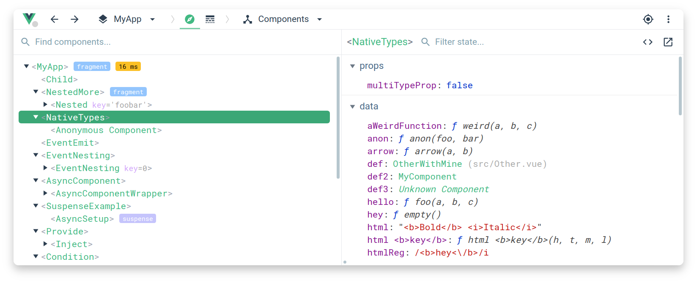

---

<!-- _class: lead -->

-   Extensión para navegador web
-   Conjunto de herramientas para desarrollo Vue
-   Inspector componentes, rutas, estados (Vuex, Pinia)
-   Visor del timeline (eventos)
-   Integración con librerías de terceros

---

<!-- _class: lead -->

# Instalación

---

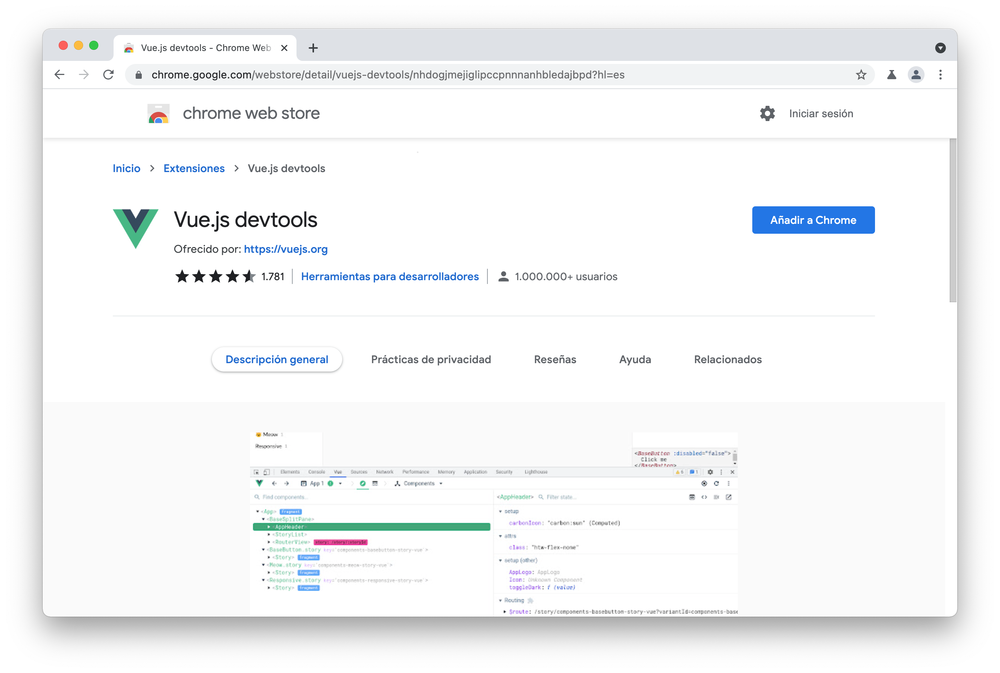

##### Chrome (WebStore)

---

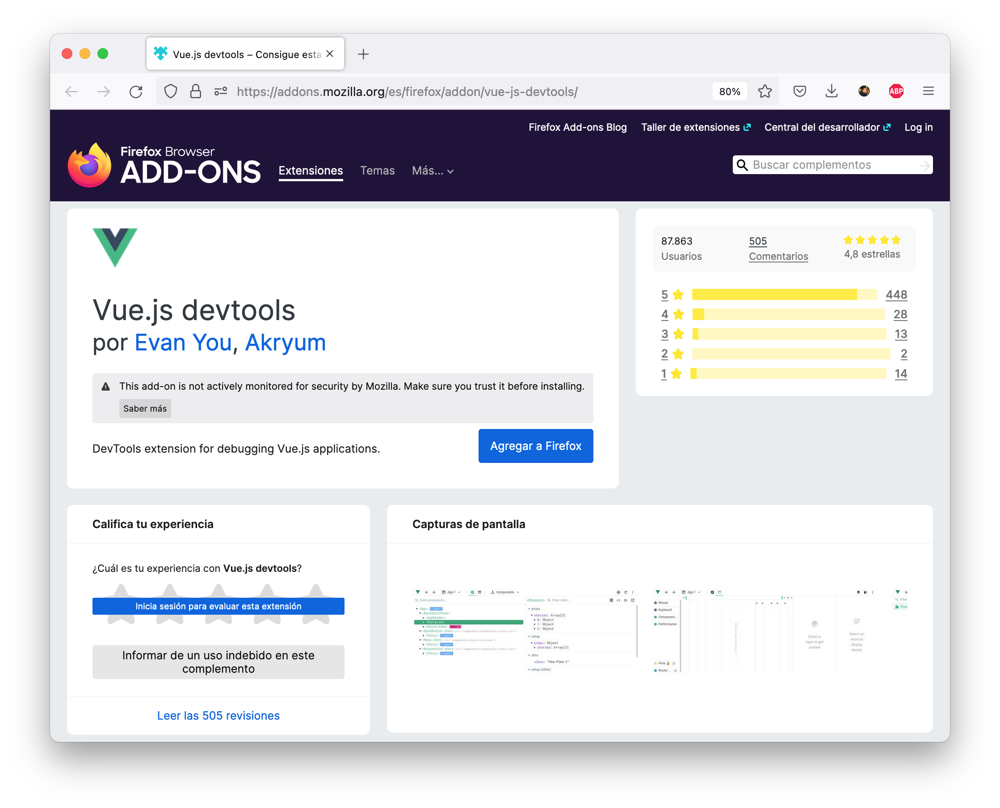

##### Firefox (Mozilla Addons)

---

<!-- _class: lead -->

# Activación

---

<!-- _class: lead -->

-   Las Vue DevTools se encontrarán dentro de las herramientas para desarrolladores del navegador, a modo de pestaña
-   La pestaña aparece automáticamente al detectar una página Vue en desarrollo
-   En nuestra primera ejecución nos hará un walkthrough

---

<!-- _class: lead -->

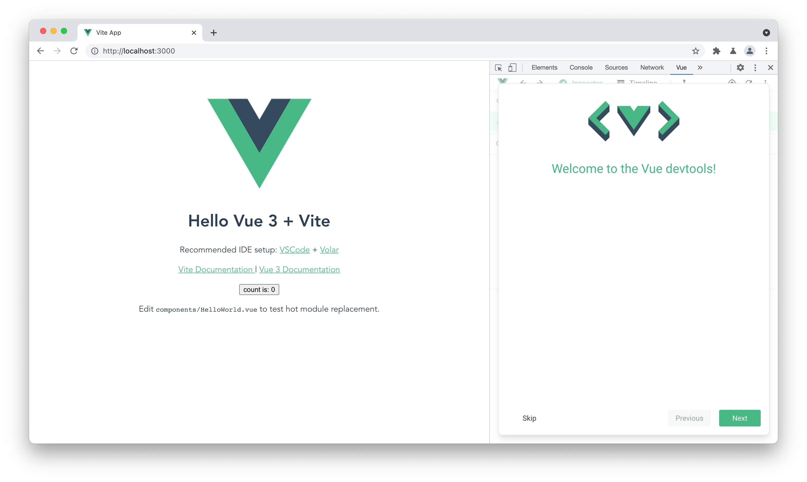

---

<!-- _class: lead -->

# Organización de la herramienta (nueva versión)

---

<!-- _class: lead -->

-   2 Tabs
-   Inspector: Muestra información de debug de Componentes, Rutas, Estado y third parties (via [Plugin API](https://devtools.vuejs.org/plugin/plugins-guide.html))
-   Timeline: Una linea temporal para distintos tipos de datos: Eventos, Performance, etc. Terceros también pueden añadir capas al timeline.

---

<!-- _class: lead -->

# Nota

-   Soporte páginas multi-app

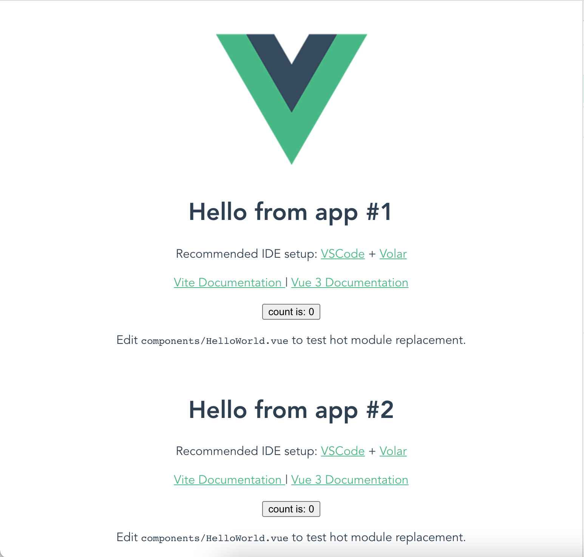

---

<!-- _class: lead -->

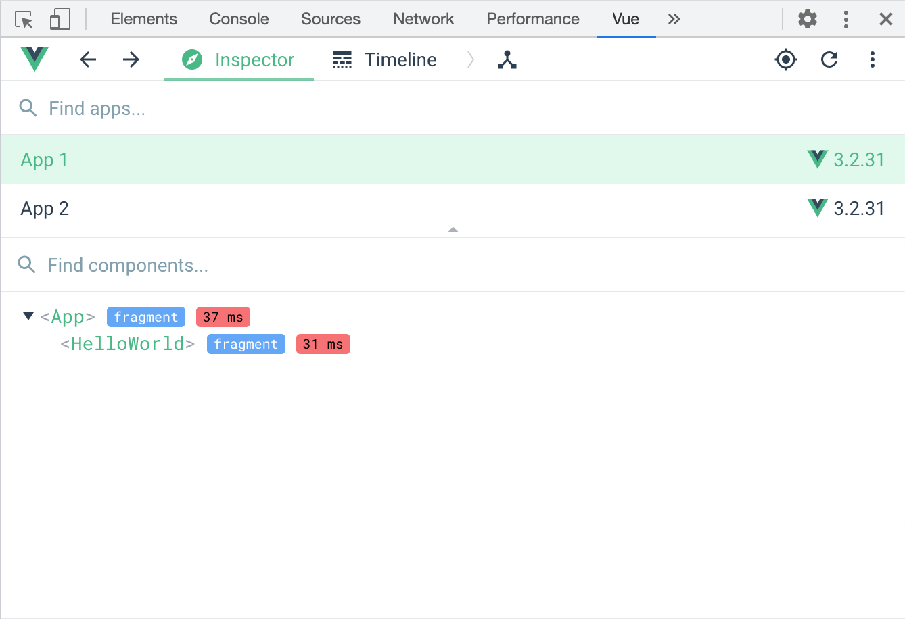

---

<!-- _class: lead -->

# Tab: Inspector

-   Aunque esta tab es extensible, veremos cómo se comporta para los 3 casos más típicos

1.  Componentes
2.  Rutas
3.  Store

---

# Tab: Inspector - Componentes

-   Nos permite navegar por los componentes de la aplicación en modo arbol desplegable.
-   Al seleccionar un componente, podremos ver todos sus props, bindings, funciones, etc.
-   Tiene live reload

---

<!-- _class: lead -->

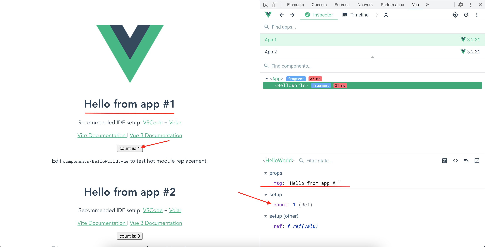

---

<!-- _class: lead -->

# Tab: Inspector - Componentes

DEMO

---

# Tab: Inspector - Router

-   Nos permite visualizar las rutas expuestas en la aplicación, así cómo sus propiedades.
-   También nos marca la ruta activa

---

<!-- _class: lead -->

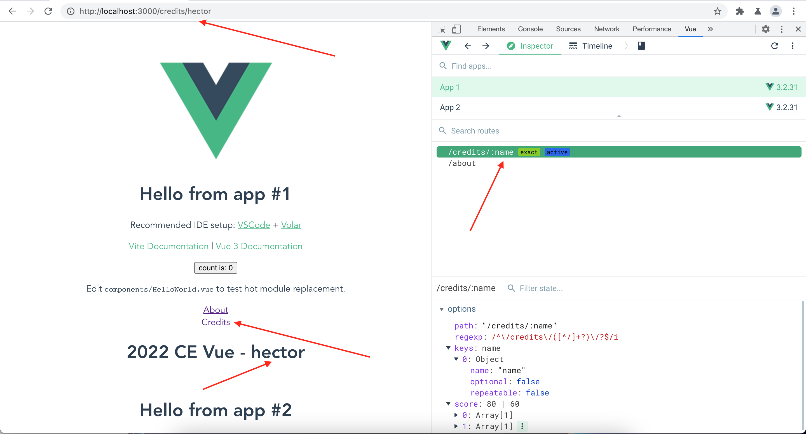

---

<!-- _class: lead -->

# Tab: Inspector - Router

DEMO

---

# Tab: Inspector - Store (Vuex)

-   Nos permite visualizar las distintas stores con las que cuenta nuestra app
-   Podremos modificar la store directamente desde las DevTools y ver los cambios en la app

---

<!-- _class: lead -->

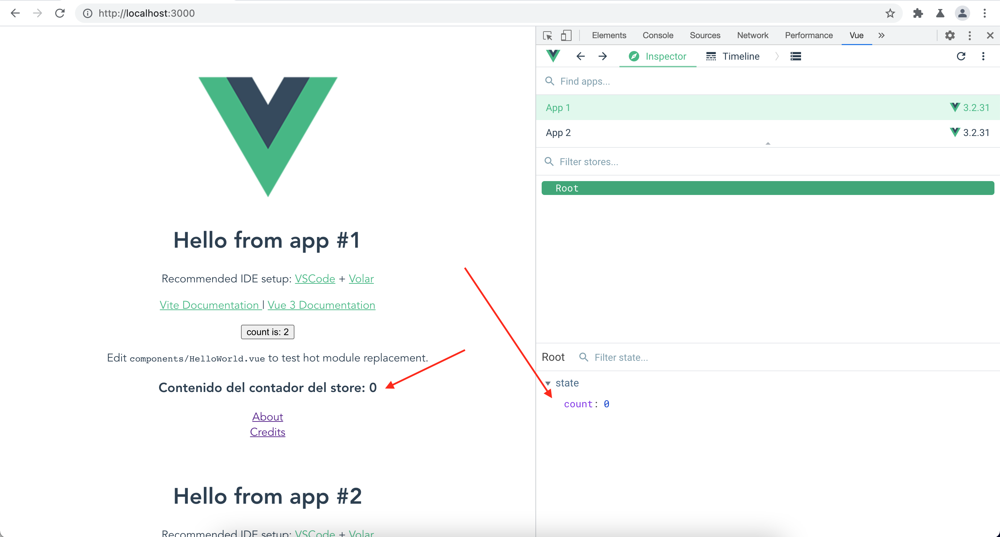

---

<!-- _class: lead -->

# Tab: Inspector - Store

DEMO

---

<!-- _class: lead -->

# Tab: Timeline

-   Por defecto, podremos ver timeline de eventos de ratón, teclado,Componentes y Performance.
-   Es extensible por terceros, en nuestro caso, tanto el router cómo vuex extienden el timeline.

---

<!-- _class: lead -->

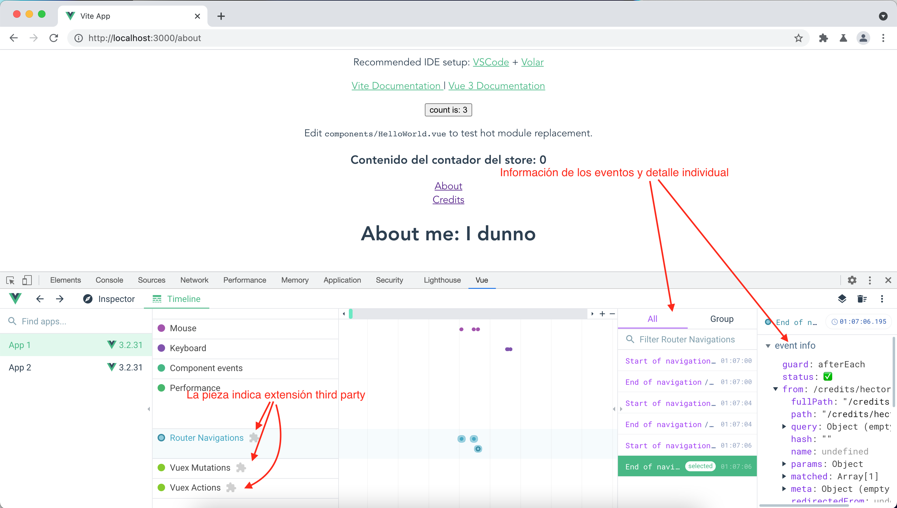

---

<!-- _class: lead -->

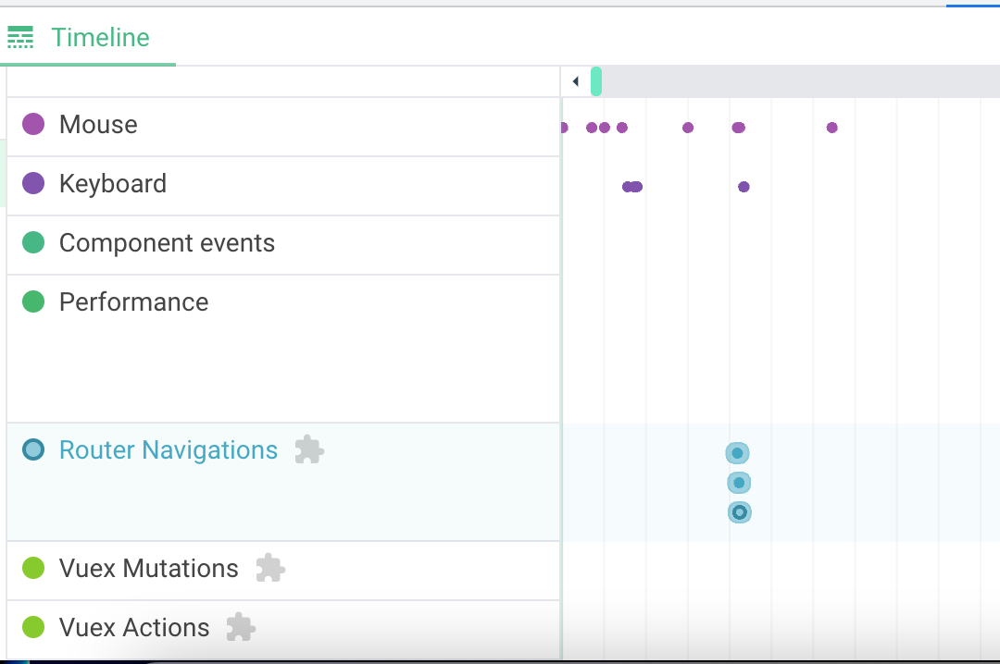

---

<!-- _class: lead -->

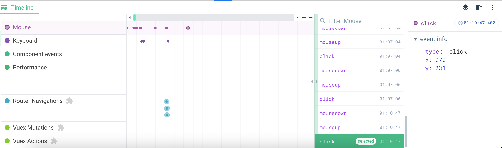

---

<!-- _class: lead -->

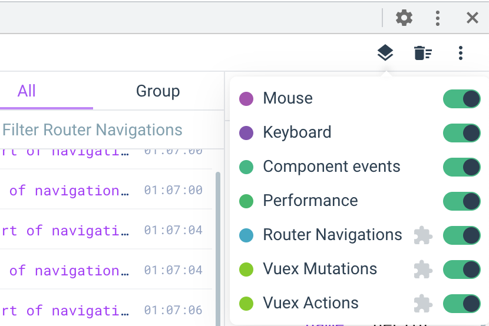

---

<!-- _class: lead -->

# FIN.
